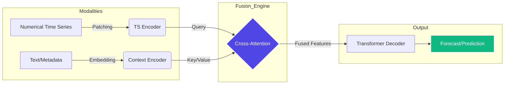

# Multimodal Time-Series Foundation Model (M-TSFM)

A modular research framework for building and training foundation models that integrate diverse modalities—**numerical time series, text, images, and exogenous data**—for robust, zero-shot forecasting.

---

## 📑 Table of Contents

1. [Overview](https://www.google.com/search?q=%23-overview)
2. [Architecture](https://www.google.com/search?q=%23-architecture)
3. [Project Structure](https://www.google.com/search?q=%23-project-structure)
4. [Installation](https://www.google.com/search?q=%23-installation)
5. [Configuration & Usage](https://www.google.com/search?q=%23-configuration--usage)
6. [Benchmarking](https://www.google.com/search?q=%23-benchmarking)
7. [References](https://www.google.com/search?q=%23-references)
8. [License](https://www.google.com/search?q=%23-license)

---

## 🧠 Overview

M-TSFM bridges the "modality gap" in temporal forecasting. By utilizing **Cross-Modal Attention**, our model aligns heterogeneous data sources, allowing for zero-shot forecasting on unseen datasets without requiring task-specific retraining.

## 🏗 Architecture

Our framework employs a modular encoder-decoder approach to fuse multimodal inputs:



---

## 📂 Project Structure

```bash
.
├── data/               # Dataset storage and pre-processing
├── models/             # Checkpoints and model configuration files
├── notebooks/          # Exploratory analysis and model demos
├── scripts/            # Execution scripts (train.py, eval.py)
├── src/                # Core source code (The "Brain")
│   ├── encoders.py     # Modality-specific encoders (TS, Text, Image)
│   ├── fusion.py       # Cross-attention / Fusion modules
│   └── utils.py        # Metrics, logging, and data utilities
├── tests/              # Unit tests for component verification
├── .gitignore          # Standard git exclusion patterns
├── LICENSE             # MIT License
├── requirements.txt    # Project dependency list
└── README.md           # Project documentation

```

## 🛠 Installation

Ensure you have Python 3.10+ installed.

```bash
# 1. Clone the repository
git clone https://github.com/phamdps/multimodalfm.git
cd multimodalfm

# 2. Setup virtual environment
python -m venv venv
source venv/bin/activate  # Windows: venv\Scripts\activate

# 3. Install dependencies
pip install --upgrade pip
pip install -r requirements.txt

```

## ⚙️ Configuration & Usage

Configuration is managed via `config.yaml`. Update your `DATA_ROOT` and `CHECKPOINT_DIR` before running scripts.

### Quick Start

```python
from src.fusion import CrossModalFusion
import torch

# Initialize fusion module
model = CrossModalFusion(ts_dim=1, context_dim=128, embed_dim=64)

# Forward pass example
ts_input = torch.randn(32, 50, 1)    # (Batch, SeqLen, Dim)
ctx_input = torch.randn(32, 10, 128) # (Batch, CtxLen, ContextDim)

output = model(ts_input, ctx_input)
print(f"Output shape: {output.shape}")

```

## 📊 Benchmarking

We support rigorous zero-shot evaluation on the **TIME** and **GIFT-Eval** benchmarks.

```bash
python scripts/eval.py --benchmark TIME --data_path ./data/TIME

```

*Evaluations generate metrics including CRPS and MAPE, following established academic protocols.*

## 📚 References

1. **TIME Benchmark:** Qiao, Z., et al. (2026). *It's TIME: Towards the Next Generation of Time Series Forecasting Benchmarks.*
2. **GIFT-Eval:** Salesforce AI Research. *A Benchmark for General Time Series Forecasting Model Evaluation.*
3. **Attention Mechanism:** Vaswani, A., et al. (2017). *Attention Is All You Need.*

## 📜 License

This project is licensed under the MIT License. See the [LICENSE](https://www.google.com/search?q=LICENSE) file for details.
